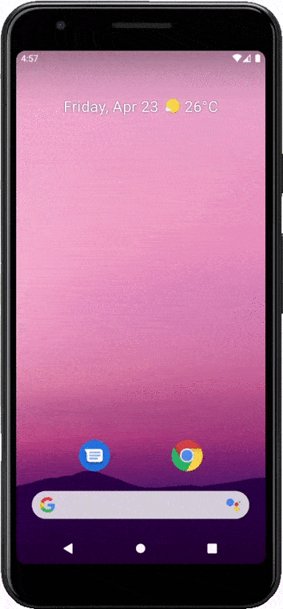
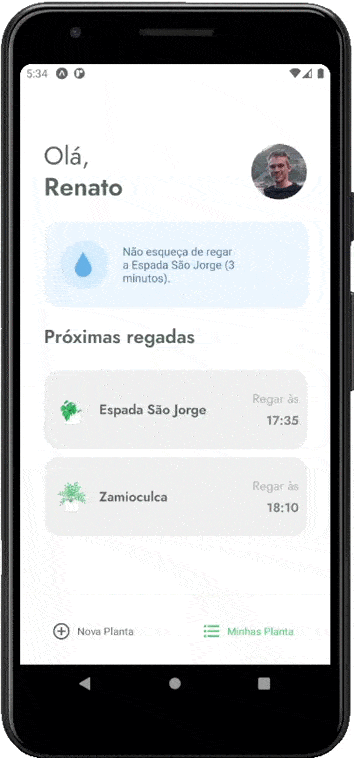

<h1 align="center"></h1>

<p align="center"></p>

# Plant Manager

## 💡 Ideia do projeto

<br/>

Projeto desenvolvido durante o evento *Next Level Week #5* da Rocketseat, com foco no desenvolvimento de aplicativos *mobile* com o React Native.

<br/>

## 🔍 Funcionalidades

<br/>

* Definição de nome de usuário para customização da tela principal;
* Visualização de diferentes tipos de plantas com informações sobre a frequência com que devem ser regadas, ambientes onde melhor se adpatam e dicas de cuidados com elas, além de permitir o filtro das plasntas pelos ambientes;
* Possibilidade de salvar as plantas que você tem em casa, definindo o horário em que gostaria de regá-las;
* Envio de notificações nos dias e horários apropriados, lembrando o usuário de regar suas plantas;
* Possibilidade de remover as plantas salvas no aplicativo;

<p align="center"></p>

💹 **Extras**

* Atualização do horário da próxima rega ao deslizar a lista de plantas para baixo;
* Verificação no caso de plantas que ainda não foram cadastradas;

<p align="center"></p>

<br/>

## 🛠 Tecnologias Utilizadas

<br/>

Para o desenvolvimento desse projeto, as seguintes tecnologias foram utilizadas:

- [React Native](https://reactnative.dev/)
- [Expo](https://expo.io/)
- [TypeScript](https://www.typescriptlang.org/)

<br/>

## 💻 Configuração do Projeto

<br/>

### Primeiramente, clone o repositório para obter uma cópia do código em sua máquina local

```bash
$ git clone https://github.com/renatomh/plantmanager && cd plantmanager
```

### Instale as dependências (comando para o yarn)

```bash
$ yarn
```

### Execute o servidor JSON

Esse servidor irá simular uma API com os dados das plantas, à qual serão feitas as requisições 

**A instalação do [*json-server*](https://github.com/typicode/json-server) deve ser feita de forma global, como no comando a seguir**

```bash
$ yarn add global json-server
```

**ou utilizando o npm**

```bash
$ npm install -g json-server
```

**Para execução do servidor, devem ser informados o caminho com o arquivo *json*, o IP da máquina onde estará rodando e o número da porta, por exemplo**

```bash
$ json-server ./src/services/server.json --host 192.168.0.2 --port 3333
```

**Podemos ainda adicionar uma opção para simular um atraso/*delay* da rede, informando o valor desejado em milissegundos**

```bash
$ json-server ./src/services/server.json --host 192.168.0.2 --port 3333 --delay 700
```

Para verificar o endereço IP da sua máquina (Windows), pode-se abrir o terminal (*cmd*) ou o *PowerShell* e executar o comando abaixo, pegando o valor do *Endereço IPv4*

```bash
$ ipconfig
```

<br/>

## 🌐 Atualização do endereço IP no arquivo de *api*

<br/>

É necessário também atualizar o endereço do servidor onde a API está rodando no arquivo *./src/services/api.ts*

```typescript
import axios from 'axios';

const api = axios.create({
    baseURL: "http://192.168.0.2:3333",
});

export default api;
```

## ⏯️ Executando o projeto

```bash
$ expo start
```

Após esse comando, o *metro bundler* será aberto no navegador. Algumas das opções para a execução da aplicação são:

#### **1 - Emulador Android**

Na página do *metro bundler*, clique em "Run on Android device / emulator" e espere carregar.

Observação: requer instalação da SDK do Adnroid, criação de um AVD, etc.

#### **2 - Emulador iOS**

Na página do *metro bundler*, clique em "Run on iOS simulator" e espere carregar.

Observação: deve-se estar utilizando um computador Mac com o XCode instalado.

#### **3 - Dispositivo Físico**

Download do aplicativo da Expo:

- [iOS](https://itunes.apple.com/app/apple-store/id982107779)
- [Android](https://play.google.com/store/apps/details?id=host.exp.exponent&referrer=www)

Após o download, basta voltar à página do *metro bundler* e escanear o código QR com o aplicativo da Expo.

<em>Para mais detalhes a respeito da execução do aplicativo em emuladores ou em um dispositivo físico, acesse <a href="https://react-native.rocketseat.dev/">esse tutorial</a>.</em>

<br />

## 📄 Licença

Esse projeto está sob a licença **MIT**. Para mais informações, accesse [LICENSE](./LICENSE).
